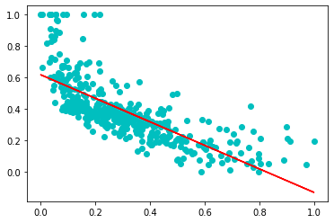
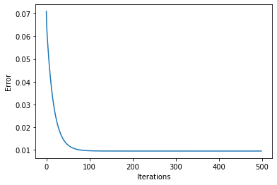

# Boston_housing_ML
Boston Housing Price Prediction with accuracy up to 79% 
--
1. Implemented by using Gradient Descent function and mean_square_error 
1. requirement for the project given in the `requirement.txt`
1. model must be iterate over 250 iterations for better accuracy 

### Model visualization for the iteration 500 

### ploting the train data over the error values 

### Error values v/s iteration over 500 
as the iteration increases error values decreases from 0.9 to 0.02

